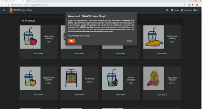
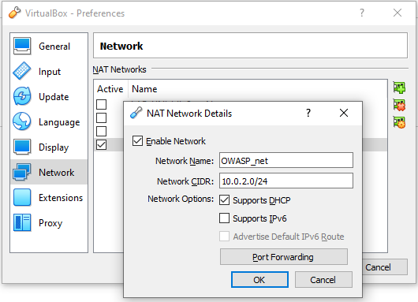
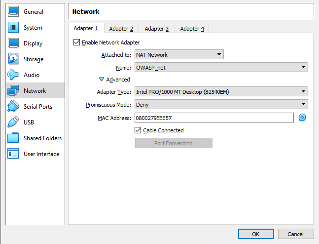

#  OWASP Juice Shop Laboratory

OWASP Juice Shop Laboratory includes a short setup guide for [OWASP Juice Shop](https://owasp-juice.shop) and some information and guides for the step-by-step resolution of the challenges on the platform with focus on the standard awareness document [OWASP Top Ten](https://owasp.org/www-project-top-ten)

## Table of contents

- [Information](#information)
    - [OWASP](#owasp)
    - [OWASP Top Ten](#owasp-top-ten)
    - [OWASP Juice Shop](#owasp-juice-shop)
- [Setup](#setup)
    - [Intro](#intro)
    - [VirtualBox VM](#virtualbox-vm)
    - [Alpine Linux](#alpine-linux)

## Information

Some info about the OWASP Foundation, the OWASP Top Ten and the Juice Shop project

### OWASP

The Open Web Application Security Project® [(OWASP)](https://owasp.org) is a nonprofit foundation that works to improve the security of software.
Through community-led open-source software projects, hundreds of local chapters worldwide, tens of thousands of members, and leading educational and training conferences, the OWASP Foundation is the source for developers and technologists to secure the web.

### OWASP Top Ten

The [OWASP Top Ten](https://owasp.org/www-project-top-ten) is a standard awareness document for developers and web application security.
It represents a broad consensus about the most critical security risks to web applications.
Globally recognized by developers as the first step towards more secure coding.
Companies should adopt this document and start the process of ensuring that their web applications minimize these risks.
Using the OWASP Top 10 is perhaps the most effective first step towards changing the software development culture within your organization into one that produces more secure code.

### OWASP Juice Shop

OWASP Juice Shop is probably the most modern and sophisticated insecure web application! It can be used in security
trainings, awareness demos, CTFs and as a guinea pig for security tools! Juice Shop encompasses vulnerabilities from the
entire
[OWASP Top Ten](https://owasp.org/www-project-top-ten) along with many other security flaws found in real-world
applications!

For a detailed introduction, full list of features and architecture overview please visit the official project page:
<https://owasp-juice.shop>

## Setup

### Intro

In this laboratory we use a small Linux distribution called [Alpine Linux](https://alpinelinux.org).  
Feel free to use the Operating System you prefer, as the core of the laboratory is Juice Shop which will be installed via [Docker](https://www.docker.com) or [node.js](https://nodejs.org)  
As mentioned Juice Shop is the core of the laboratory, it is possible to install it in many other ways:

> You can find some less common installation variations in
> [the _Running OWASP Juice Shop_ documentation](https://pwning.owasp-juice.shop/part1/running.html).

> Visit the [official github repository](https://github.com/juice-shop/juice-shop) for more details on installation and more

### VirtualBox VM

1. Download and Install [VirtualBox](https://www.virtualbox.org)
2. Download and Install also the [VirtualBox VM VirtualBox Extension Pack](https://www.virtualbox.org/manual/ch01.html#intro-installing)
3. Create a new virtual machine with at least ***512 MB of RAM and 1 GB of disk space***.  
    > More information on how to install Alpine Linux on a virtual machine can be found [here](https://wiki.alpinelinux.org/wiki/Installing_Alpine_in_a_virtual_machine)  
    *It is recommended to raise both the RAM and disk space specifications if the host machine resources allow it*  
4. Optional tweaks:
    - Settings -> General -> Description: *fell free to use this [banner](assets/banners/vm_description.txt) to remember the username and password chosen*
    - Settings -> System -> Processor(s): *if the host machine resources allow it, raise to 2 CPU*
    - Settings -> System -> Motherboard -> Boot Order: *disallow Floppy and move it to the bottom of the list*
5. To reach the machine is necessary to set a dedicated network for the laboratory:
    - On VirtualBox go to:  
    File -> Preferences -> Network -> *Add and activate a new NAT network as shown in the picture:*
    
    
    
    - On the virtual machine settings go to:  
    Settings -> Network -> *then set up a network adapter as shown in the figure:*
        
    

### Alpine Linux

